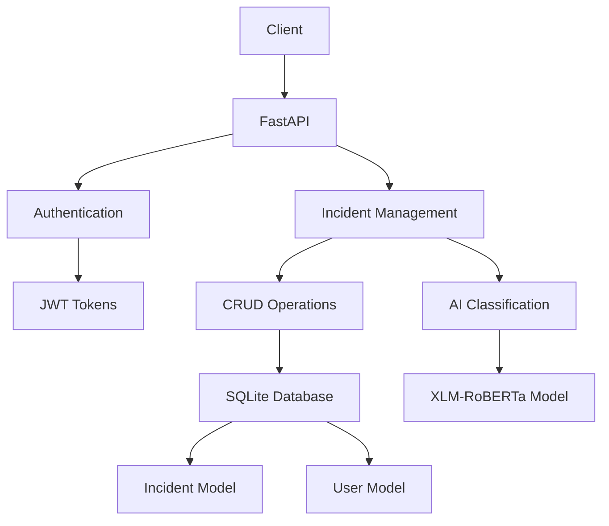
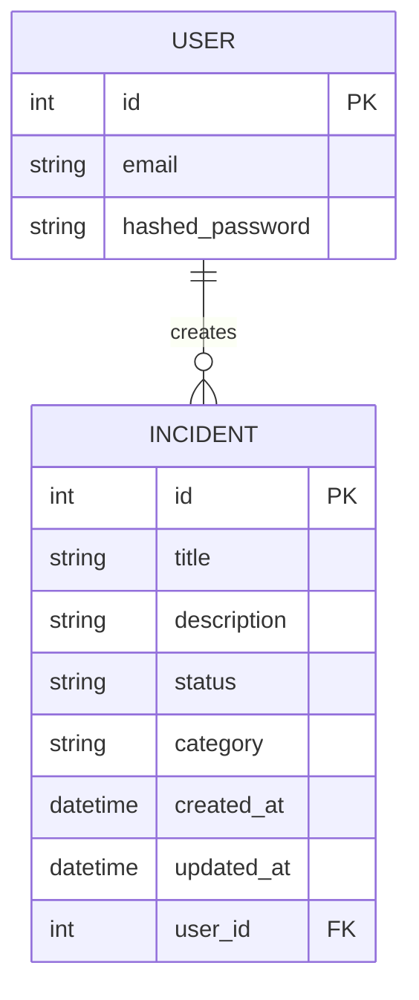
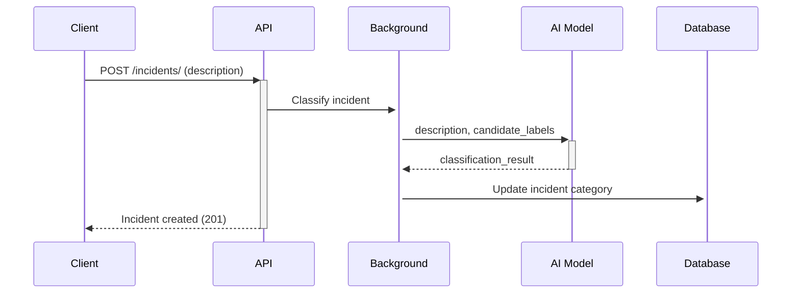

# Incident Management System

A comprehensive system for tracking, categorizing, and managing incidents using FastAPI and AI-powered classification.

## Overview


The Incident Management System provides a robust platform for organizations to track and manage incidents with AI-powered automatic categorization. It features JWT authentication, RESTful API endpoints, and integrates with Hugging Face's XLM-RoBERTa model for multilingual incident classification.

## System Architecture



## Database Schema



## Key Features

- **Incident Tracking**: Full CRUD operations for incident management
- **AI-Powered Classification**: Automatic categorization using XLM-RoBERTa model
- **JWT Authentication**: Secure token-based user authentication
- **RESTful API**: Well-documented endpoints following OpenAPI standards
- **Modular Architecture**: Clean separation of concerns with models, schemas, services, and endpoints

## Technical Stack

| Component          | Technology                          |
|--------------------|-------------------------------------|
| Backend Framework  | FastAPI                             |
| Database           | SQLite (configurable)               |
| ORM                | SQLAlchemy 2.0                      |
| Authentication     | JWT with OAuth2 Password Bearer     |
| AI Classification  | Hugging Face Transformers           |
| Model              | XLM-RoBERTa-large-xnli              |
| Testing            | Pytest                              |
| Dependency Mgmt    | Poetry                              |

## Installation

```bash
# Clone repository
git clone https://github.com/suender-oliveira/incident-management.git
cd incident-management

# Create virtual environment
python -m venv venv
source venv/bin/activate  # Linux/Mac
.\venv\Scripts\activate   # Windows

# Install dependencies
poetry install

# Initialize database
python init_db.py

# Launch application
uvicorn main:app --reload
```

## API Endpoints

### Authentication
| Method | Endpoint       | Description                |
|--------|----------------|----------------------------|
| POST   | `/auth/token`  | Get JWT access token       |

### Incidents
| Method | Endpoint       | Description                |
|--------|----------------|----------------------------|
| POST   | `/incidents/`  | Create new incident        |
| GET    | `/incidents/`  | List all incidents         |
| PUT    | `/incidents/{id}` | Update incident        |
| DELETE | `/incidents/{id}` | Delete incident        |

## AI Classification

The system uses a pre-trained XLM-RoBERTa model for zero-shot classification of incidents. The model supports multiple languages and understands semantic meaning rather than simple keyword matching.



Supported categories:
- Network Issue
- Server Issue
- Software Issue
- Login Issue
- Others

## Development

### Running Tests
```bash
pytest tests/ -v
```

### Adding New Categories
Modify the `candidate_labels` list in `app/services/classifier.py`:
```python
candidate_labels = [
    "Network Issue",
    "Server Issue",
    "Software Issue",
    "Login Issue",
    "Others",
    "New Category"  # Add your new category here
]
```

## Configuration

Environment variables (set in `app/core/config.py`):
- `SECRET_KEY`: JWT signing key (change in production!)
- `ALGORITHM`: JWT algorithm (default HS256)
- `ACCESS_TOKEN_EXPIRE_MINUTES`: Token validity period
- `SQLALCHEMY_DATABASE_URL`: Database connection string

## Deployment Considerations

- For production, consider:
  - Using PostgreSQL instead of SQLite
  - Configuring proper database connection pooling
  - Implementing rate limiting
  - Setting up proper logging
  - Using GPU acceleration for the classifier (`device="cuda"`)

## License

Apache License 2.0 - See [LICENSE](LICENSE) for details.

## Contributing

1. Fork the repository
2. Create your feature branch (`git checkout -b feature/AmazingFeature`)
3. Commit your changes (`git commit -m 'Add some AmazingFeature'`)
4. Push to the branch (`git push origin feature/AmazingFeature`)
5. Open a Pull Request

## Support

For issues or questions, please open an issue on the [GitHub repository](https://github.com/suender-oliveira/incident-management).
